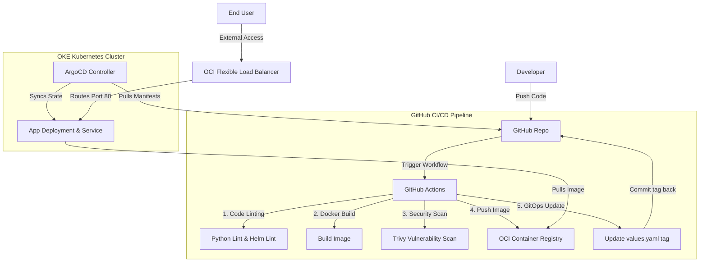

# OKE Cloud-Native Web Application

A cloud-native web application with a high-fidelity glassmorphic UI, deployed on **Oracle Container Engine for Kubernetes (OKE)**. This project leverages modern DevSecOps and GitOps practices to maintain a highly secure, automated, and observable deployment lifecycle.

---

## 🏗️ Architecture Overview



### Key Components:
- **Application**: Lightweight Python Flask backend serving a responsive, animated glassmorphic frontend utilizing modern CSS, dark/light theme options, and custom Google Fonts (`Outfit` / `JetBrains Mono`). It queries the Kubernetes Downward API to dynamically report host nodes, namespaces, and pod details.
- **Infrastructure**: OCI Container Registry (OCIR) resource created and managed declaratively via **Terraform**.
- **Packaging**: **Helm Chart** configuring high-availability replicas, container resources limits, non-root execution contexts, and standard TCP routing.
- **DevSecOps**: **GitHub Actions** runs syntax linting, Helm verification, and **Aqua Trivy** image security scans to block builds containing critical/high vulnerabilities.
- **GitOps**: **ArgoCD** syncs repository states. The pipeline updates the image tag in git, and ArgoCD applies the changes, separating build and deploy permissions.

---

## 🚀 Step-by-Step Deployment Guide

### 1. Provision OCI Registry via Terraform
We already provisioned the OCI Container Registry using Terraform:
- **Endpoint**: `uk-london-1.ocir.io`
- **Registry Path**: `uk-london-1.ocir.io/lryo68b31h2j/oke-app`

If you ever need to apply infrastructure updates:
```bash
cd terraform
terraform init
terraform apply
```

---

### 2. Configure GitHub Secrets
In your GitHub repository, navigate to **Settings > Secrets and variables > Actions** and add the following secrets:

1. **`OCI_REGISTRY_USER`**: Your OCI login username.
   - *Format for native users*: `<tenancy-namespace>/<username>` (e.g. `lryo68b31h2j/<your-username>`)
   - *Format for IDCS federated users*: `<tenancy-namespace>/oracleidentitycloudservice/<username>` (e.g. `lryo68b31h2j/oracleidentitycloudservice/<your-username>`)
2. **`OCI_AUTH_TOKEN`**: Your OCI Auth Token (generated in the OCI Console under **User Settings > Auth Tokens**).

---

### 3. Deploy Registry Credentials to OKE
Since our registry is private, OKE needs credentials to pull the image. Create the `ocir-secret` in your cluster's `default` namespace:

```bash
kubectl create secret docker-registry ocir-secret \
  --docker-server=uk-london-1.ocir.io \
  --docker-username="lryo68b31h2j/oracleidentitycloudservice/<your-username>" \
  --docker-password="<YOUR_OCI_AUTH_TOKEN>" \
  --docker-email="<your-email>"
```
*(Replace user details and `<YOUR_OCI_AUTH_TOKEN>` with your actual values).*

---

### 4. Setup GitOps on OKE via ArgoCD

#### A. Install ArgoCD (if not already installed)
If you do not have ArgoCD running on your cluster, run:
```bash
kubectl create namespace argocd
kubectl apply -n argocd -f https://raw.githubusercontent.com/argoproj/argo-cd/stable/manifests/install.yaml
```

Make the ArgoCD server accessible (e.g. via Port Forwarding):
```bash
kubectl port-forward svc/argocd-server -n argocd 8080:443
```
Login using the username `admin` and fetch the default password via:
```bash
kubectl -n argocd get secret argocd-initial-admin-secret -o jsonpath="{.data.password}" | base64 -d
```

#### B. Deploy the ArgoCD Application Manifest
1. In [gitops/argocd-app.yaml](file:///Users/ahmedibrahim/repos/OKE-App/gitops/argocd-app.yaml), edit the `repoURL` value to match your actual GitHub repository location.
2. Apply the manifest to your cluster:
   ```bash
   kubectl apply -f gitops/argocd-app.yaml
   ```

ArgoCD will pick up the Helm chart in the `helm/oke-app` directory and deploy the replicas.

---

### 5. Access the Web Application
Once ArgoCD synchronizes the state, OKE will provision an Oracle Network Load Balancer (or LB) with an external public IP.

Retrieve the public IP address of your application service:
```bash
kubectl get svc -w
```
Look for the external IP of the `oke-app` service. Once assigned, open it in your browser:
```
http://<EXTERNAL_IP>
```

---

## 🛠️ Local Development

To run the Flask application locally for frontend iterations:

```bash
cd app
# 1. Create a virtual environment
python3 -m venv venv
source venv/bin/activate

# 2. Install dependencies
pip install -r requirements.txt

# 3. Launch Flask
python3 app.py
```
Open [http://localhost:5000](http://localhost:5000) to view the live dashboard.